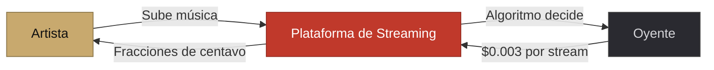
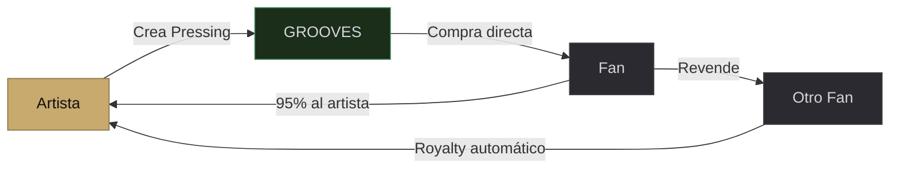

# II. El Problema

## 2.1 — Un ecosistema diseñado contra el creador

En el modelo actual de streaming, el artista cede el control de su obra al momento de distribuirla. Las plataformas deciden cuánto paga cada reproducción (fracciones de centavo), cómo se descubre la música (algoritmos opacos), y quién tiene acceso. El artista no tiene relación directa con su audiencia. No sabe quién valora su música porque el sistema no está diseñado para que nadie la posea.

El artista independiente enfrenta un sistema diseñado para volumen, donde un millón de canciones nuevas se suben cada semana y la atención del oyente se fragmenta hasta volverse insignificante. Las disqueras tradicionales, por su parte, ofrecen adelantos a cambio de derechos master que el artista rara vez recupera.

Pero el problema no termina en el artista independiente. Los propios sellos discográficos — desde las pequeñas disqueras hasta las grandes majors — operan dentro de un modelo que subestima el valor de su catálogo. Un catálogo que contiene décadas de historia musical se reduce a fracciones de centavo por stream, sin ninguna herramienta para crear escasez, exclusividad o experiencias diferenciadas alrededor de su música.

> [!WARNING]
> **1,000,000 streams = ~$3,000 USD.** Un artista necesita más de un millón de reproducciones para ganar lo equivalente a un salario mínimo mensual. El sistema actual no fue diseñado para remunerar al creador.

### Grooves es una oportunidad para todos los actores del ecosistema musical

Grooves está diseñado para que cualquier creador — desde el artista independiente hasta el sello discográfico más grande del mundo — encuentre un modelo superior al actual. Para el artista independiente, significa control total y pagos directos. Para un gran sello, significa una nueva forma de monetizar catálogos que hoy solo generan fracciones de centavo por stream, creando experiencias premium que sus fanáticos están dispuestos a poseer y coleccionar.

> [!NOTE]
> Imagina a un gran sello creando Pressings de acceso a catálogos históricos completos: toda la música de los años 70 de un artista legendario como un Sealed Edition de 10,000 unidades, con acceso a material inédito, sesiones de estudio remasterizadas y documentales exclusivos. O un Open Edition del catálogo completo de un género, donde cada Pressing incluye acceso a una comunidad curada por los propios artistas. Las posibilidades para monetizar catálogos que hoy solo generan fracciones de centavo por stream son ilimitadas.

---

## 2.2 — El fan no posee nada

Un usuario de Spotify que ha pagado $11 al mes durante 10 años ha invertido $1,320 en música. ¿Qué posee? Nada. Si cancela su suscripción, pierde acceso a todo. Si Spotify cierra, pierde acceso a todo. Su "biblioteca" es una lista de enlaces que apuntan a servidores que no controla.

| | Streaming (hoy) | Grooves (propiedad) |
|---|---|---|
| **Inversión 10 años** | $1,320 | ~$150 (10 Pressings) |
| **¿Qué posee?** | Nada | 10 obras revendibles |
| **Si cancela** | Pierde todo | Conserva todo |
| **Si el artista crece** | Nada cambia | Sus Pressings se revalorizan |

Contraste esto con el coleccionista de vinilos: cada disco que compró sigue siendo suyo. Puede venderlo, regalarlo, heredarlo. Algunos discos se revalorizan con el tiempo. La relación entre el fan y la obra es tangible, permanente, real.

---

## 2.3 — El mercado secundario no beneficia al artista

Cuando un vinilo raro se vende por miles de dólares en el mercado secundario, el artista original no recibe nada. Los mercados de reventa de entradas a conciertos generan miles de millones de dólares al año sin que un centavo regrese al creador.

```mermaid
graph TB
    subgraph HOY["Modelo Actual"]
        A1[Fan vende vinilo raro por $5,000] --> B1[Comprador paga]
        B1 --> C1[Artista recibe: $0]
    end
    subgraph GROOVES["Modelo Grooves"]
        A2[Fan vende Pressing por $5,000] --> B2[Comprador paga]
        B2 --> C2[Artista recibe royalty automático]
        B2 --> D2[Vendedor recibe el resto]
    end
    style HOY fill:#2e1a1a,stroke:#c0392b
    style GROOVES fill:#1a2e1a,stroke:#4a8c5c
    style C1 fill:#c0392b,color:#fff,stroke:#962d22
    style C2 fill:#C8A96E,color:#111,stroke:#8a7548
    style D2 fill:#2a2a30,color:#d4d4d8,stroke:#444
```

La tecnología blockchain resuelve esto de forma programática: cada vez que una obra cambia de manos, un porcentaje definido por el artista regresa automáticamente a su billetera. No es una promesa contractual — es código ejecutable que no puede ser alterado.
