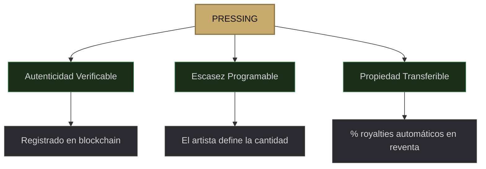
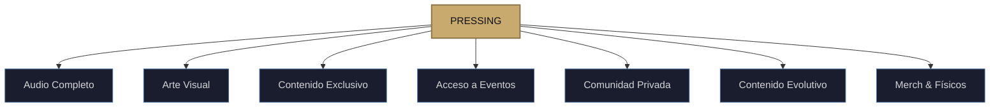
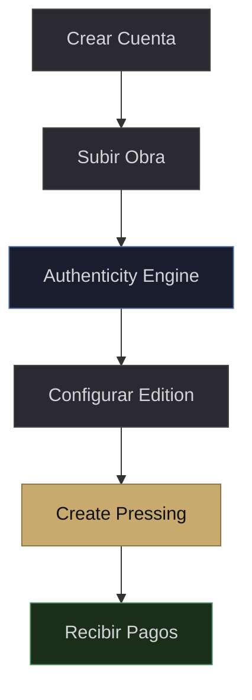
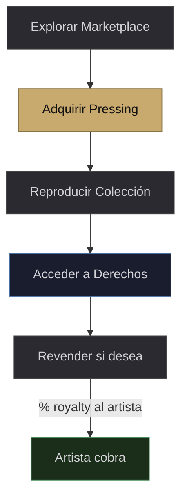
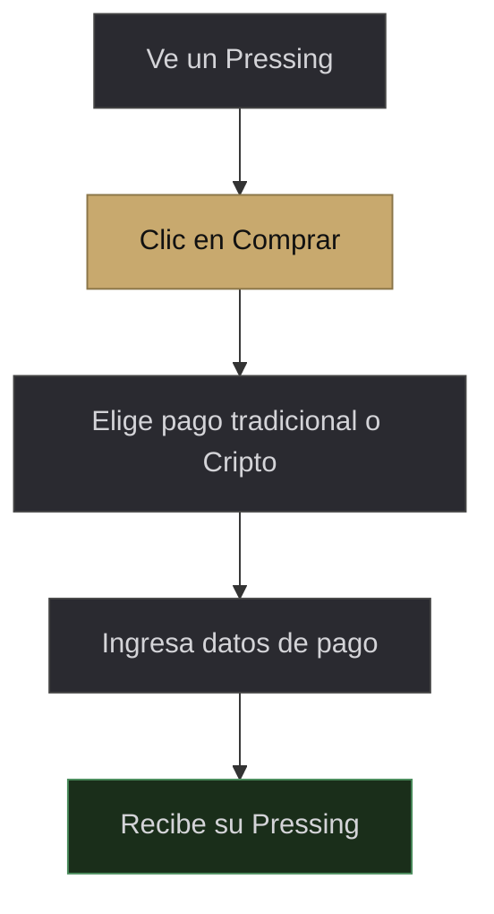

# III. La Solución — El Ecosistema Grooves

## 3.1 — Concepto Central: El Pressing como Llave de Acceso

En Grooves, cada obra creativa publicada se denomina un **Pressing**.

Un Pressing no es simplemente un archivo de audio digitalizado. Es un **objeto digital autenticado que funciona como llave de acceso** a todo un universo creativo definido por el artista o el sello. Cada Pressing está registrado en blockchain, de manera perpetua, público en inernet de manera que cualquier persona lo puede auditar, lo que garantiza tres propiedades fundamentales:

* **Autenticidad verificable.** Cualquiera puede comprobar que el Pressing fue creado por el artista original.
* **Escasez programable.** El artista decide cuántos Pressings existen de cada obra, si es una colección limitada o ilimitada.
* **Propiedad transferible.** El poseedor puede venderlo, regalarlo o transferirlo. En cada reventa, el artista creador del pressing recibe automáticamente su % royalty.
* **Porcentajes de creación.** El Creador del pressing puede hacer splits de % de ganancia como se acuerde. Ejemplo: X% para los músicos participantes, x% para los managers, X% para el sello discografico, x% para los publishers etc. Todo estos "splits" pueden quedar consignados de manera perpetua o por tiempos establecidos a elección, automaticamente distribuidos en cada venta y reventa. Sin intermediarios. 

Lo que hace único al Pressing es que **el artista o sello define libremente qué derechos de acceso otorga**. El audio del álbum es solo el punto de partida. Un Pressing puede desbloquear cualquier combinación de experiencias que el creador imagine:

---

### Ejemplo: Artista independiente — Álbum + Mundo Creativo

> Un músico independiente crea un "Sealed Edition" de 300 Pressings de su nuevo álbum. Cada Pressing da acceso al álbum completo a la reproducción en calidad lossless de manera perpetua, pero también la participación a los poseedores de ese pressing acceso a participar en un podcast exclusivo de 8 episodios donde el artista cuenta la historia detrás de cada canción, o por ejemplo acceso anticipado a las entradas de su próxima gira en una zona VIP o por ejemplo, material real: un libro con las partituras del disco o por ejemplo, Merch: unas camsietas edición limitada. Si el artista crece, esos 300 Pressings se revalorizan, sus compradores lo pueden reevender para dar ese acceso a otra gente, asi mismo cada reventa le genera royalties automáticos al creador y/o participantes adjuntos (si los hubo) dependiendo del acuerdo que se haga previo a la creación.

### Ejemplo: Sello discográfico grande — Catálogo Histórico como Experiencia

> Un gran sello de gan envergadura tambien es un usuario de Grooves. Crea un Sealed Edition de 10,000 Pressings llamado "The Vinyl Vault: Los 70s". Cada Pressing desbloquea el catálogo completo de la década, sesiones de estudio remasterizadas nunca publicadas, un documental exclusivo sobre la época, y por ejemplo acceso a listening parties virtuales con productores legendarios. El sello genera ingresos directos masivos en lugar de fracciones de centavo por stream, y cobra royalties en cada reventa futura. Las posisibilidades de crear pressings y monetizar con distintas funcionalidades son infinitas. Es vincular la música a toda una experiencia, a un ecosistema creativo para el consumidor. 

### Ejemplo: Banda emergente — Acceso a la Comunidad

> Una banda crea un Open Edition sin límite de copias. Cada Pressing cuesta $5 y da acceso al EP completo, pero por ejemplo también da acceso a un grupo privado donde la banda comparte demos, vota con los fans sobre el setlist de conciertos, y ofrece descuentos en merch. A medida que la banda crece, añade más contenido vinculado al Pressing: versiones en vivo, colaboraciones, behind-the-scenes. El Pressing se convierte en un objeto vivo que evoluciona con la carrera del artista.

---

El conjunto de Pressings de una obra se denomina un **Edition**:

* **Sealed Edition** — Edición limitada e inmutable. 500 Pressings y nunca habrá uno más. Crea escasez y valor de colección.
* **Open Edition** — Edición flexible. El creador ajusta la cantidad según demanda. Ideal para sellos con catálogos extensos.

---

## 3.2 — Derechos de Acceso: Qué Puede Desbloquear un Pressing

El artista o sello configura libremente qué derechos de acceso otorga cada Pressing. Esta es la lista de posibilidades, pero no el límite — cualquier experiencia digital puede vincularse:

| Derecho de Acceso | Descripción | Ejemplo |
|---|---|---|
| **Audio completo** | Álbum, EP o sencillo en calidad lossless | El álbum completo en FLAC/WAV |
| **Arte visual** | Portadas, fotografías, videos del proceso | Galería de fotos del estudio, arte en alta resolución |
| **Contenido exclusivo** | Material que solo los poseedores pueden acceder | Podcast track-by-track, versiones demo, comentarios del artista |
| **Acceso a eventos** | El Pressing funciona como boleto de entrada | Conciertos privados, listening parties, meet & greets |
| **Comunidad privada** | Canales exclusivos de interacción directa | Discord/Telegram privado, votaciones, Q&A con el artista |
| **Contenido evolutivo** | Con el tiempo, los poseedores de X edición, podrán tener acceso a otros contenidos. | Versiones en vivo, colaboraciones |
| **Merch & físicos** | Descuentos o acceso prioritario a mercancía | Libros de partituras, T-shirts exclusivas, Merch en general |

> [!TIP]
> La clave es que el Pressing no es solo un disco: **es una membrecía creativa**. Poseer un Pressing significa tener acceso permanente al mundo del artista, y ese acceso crece en valor con su carrera.

---

## 3.3 — Flujo del Artista Independiente

1. **Crea tu cuenta en Grooves.** Conecta tu wallet o crea una dentro de la plataforma.
2. **Sube tu obra al Pressing Studio.** Audio, arte, metadata y define tus derechos de acceso.
3. **Análisis de autenticidad.** El Authenticity Engine verifica que no se infringen derechos de autor.
4. **Configura tu Edition.** Sealed u Open, precio, porcentajes de royaltys, contenido vinculado.
5. **Create your Pressing.** La obra se registra en blockchain y queda disponible en el marketplace.
6. **Recibe pagos directos.** Cada venta y cada reventa futura genera royalties automáticos.

---

## 3.4 — Flujo de la Disquera / Sello

Los sellos discográficos gestionan sus catálogos completos en open editions o sealed editions. Pueden convertir su catálogo completo en Pressings, gestionar inventario flexible o limitado, configurar distribución de royalties entre sello, artista, productores, managers, publishers y colaboradores vía smart contracts, y crear Pressings por lotes para subir cientos de álbumes en una sola operación. También pueden crear Sealed Editions especiales para lanzamientos premium o catálogos históricos.

> [!NOTE]
> **Batch Creation:** Los sellos pueden subir cientos de álbumes en una sola transacción, configurar royalty splits automáticos entre sello/artista/productores, y gestionar todo desde una sola interfaz.

---

## 3.5 — Flujo del Coleccionista / Fan

1. **Explora el marketplace.** Descubre artistas, navega catálogos, escucha previews.
2. **Adquiere Pressings.** Compra directamente del artista o en el mercado secundario.
3. **Reproduce tu colección.** Interfaz familiar: play, pause, cola, playlists. Cada pieza es tuya.
4. **Accede a tus derechos.** Podcasts, videos, entradas a eventos, partituras, comunidades, todo lo vinculado a tu Pressing.
5. **Revende si lo deseas.** Si un artista explota, tu Pressing se revaloriza. El artista cobra % royalty en cada reventa.

---

## 3.6 — Onboarding sin Fricción: Pagar sin Saber de la tecnología que hay detrás.

Para que Grooves sea accesible a cualquier fan y artista  no solo a los que ya entienden de criptografia,  la plataforma elimina toda fricción técnica del proceso de compra y registro.

### Wallet automática

Cuando un usuario crea su cuenta en Grooves con email o redes sociales, la plataforma genera automáticamente una wallet en segundo plano. El usuario no necesita instalar MetaMask, entender qué es una seed phrase, ni interactuar con ninguna interfaz de blockchain. Su wallet existe, está segura, y funciona pero es invisible. ASi mismo, puede entrar a la paltaforma con cold wallets o hot wallets externas.

### Pago con tarjeta y PayPal (Fiat On-Ramp)

El fan no necesita comprar USDC por su cuenta. Grooves integra servicios de conversión de moneda fiat a cripto (on-ramp) directamente en la interfaz de compra. El usuario ve un botón que dice "Pagar $15 con tarjeta" o "Pagar con PayPal", ingresa los datos de su tarjeta de débito, crédito o su cuenta de PayPal, y el servicio convierte automáticamente los dólares a USDC y los deposita en la wallet del usuario para completar la compra. Todo sucede en segundos.

Los servicios de on-ramp como MoonPay, Transak o Stripe Crypto se integran vía API como un widget dentro de la aplicación. Están regulados, cumplen KYC/AML, y soportan múltiples métodos de pago en múltiples países.

### La experiencia desde la perspectiva del usuario

1. Ve un Pressing que le gusta en el marketplace.
2. Hace clic en "Comprar".
3. Elige pagar con tarjeta de crédito, débito, PayPal o Cripto.
4. Ingresa sus datos de pago (como en cualquier tienda online).
5. Recibe su Pressing. Puede reproducirlo, acceder al contenido vinculado, y revenderlo cuando quiera.

> [!NOTE]
> En ningún momento del proceso el usuario necesita saber qué es una wallet, qué es USDC, ni qué es blockchain. La tecnología es invisible. La experiencia es idéntica a comprar en cualquier tienda online.
