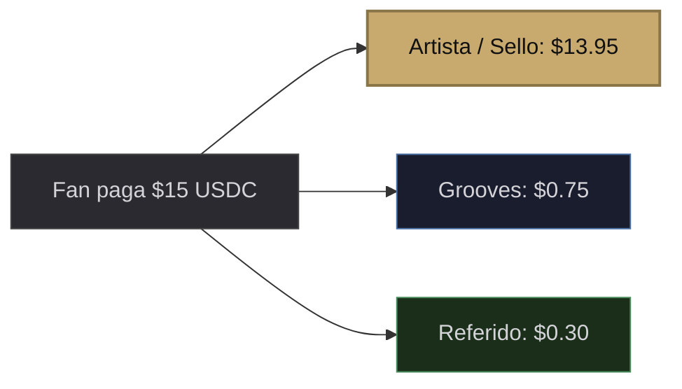
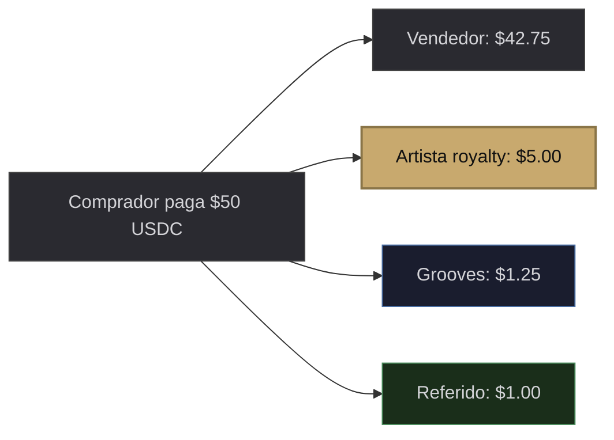
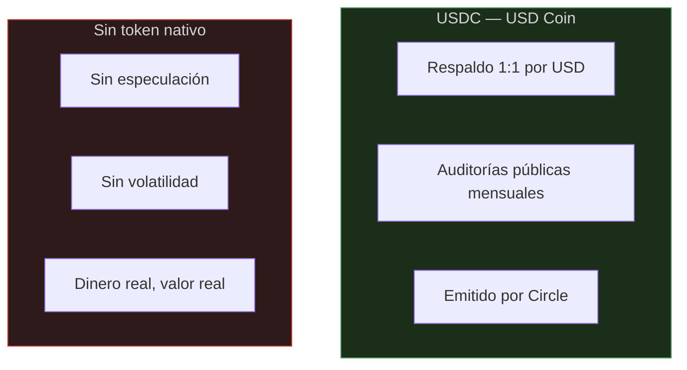

# IV. Modelo Económico

## 4.1 — Crear es Gratis

Publicar una obra en Grooves no tiene ningún costo para el artista. No hay tarifas de creación, ni costos de subida, ni comisiones por listar. El artista sube su obra al Pressing Studio, configura su Edition, y crea sus Pressings sin pagar un solo centavo.

> [!TIP]
> **Grooves solo gana cuando el artista gana.** La plataforma cobra comisión únicamente cuando un Pressing se vende. Si el artista no vende, Grooves no cobra. Los incentivos están completamente alineados.

---

## 4.2 — Distribución de Valor

### Venta Primaria (artista → fan)

| Destinatario | Porcentaje |
|---|---|
| Artista / Sello | 93% |
| Grooves (comisión de plataforma) | 5% |
| Referido (opcional) | 2% |

### Reventa Secundaria (fan → fan)

| Destinatario | Porcentaje |
|---|---|
| Vendedor | Precio menos comisiones |
| Artista / Sello (royalty) | 5-15% (configurable por el artista) |
| Grooves (comisión de plataforma) | 2.5% |
| Referido (opcional) | 2% |

> [!NOTE]
> **Sistema de referidos:** Cuando un fan comparte un link de Grooves y alguien compra a través de ese link, el fan que refirió recibe un 2% del precio de venta automáticamente. Los fans se convierten en promotores con incentivo real. Si no hay referido, ese 2% se queda con el artista.

---

## 4.3 — Comparativa de Valor

| Concepto | Spotify (Streaming) | Grooves (Propiedad) |
|---|---|---|
| Fan paga $132/año por 10 años | $1,320 invertidos. Posee: **nada**. | Compra 10 Pressings a ~$15. Posee **10 obras revendibles**. |
| Artista indie con 10,000 fans | ~$400/mes en royalties de streaming | 500 Pressings a $15 = **$7,125 directos** + royalties en cada reventa futura. |
| Artista crece en popularidad | Fan sigue pagando $11/mes, sin cambios | Pressings se revalorizan. **Fan gana. Artista cobra en cada reventa.** |
| Fan cancela suscripción | **Pierde acceso a todo** | **Sigue poseyendo todos sus Pressings para siempre.** |

> [!WARNING]
> **$1,320 en streaming = $0 en propiedad.** En 10 años de suscripción, el fan invierte más de mil dólares y no posee absolutamente nada. En Grooves, cada dólar invertido es un activo que se conserva, se revaloriza y se puede revender.

---

## 4.4 — Moneda de Operación: USDC

Todas las transacciones en Grooves se realizan en **USDC** (USD Coin), el stablecoin emitido por Circle y respaldado 1:1 por el dólar estadounidense con auditorías públicas mensuales de sus reservas. Esta es una decisión de diseño fundamental, no una limitación técnica.

> [!WARNING]
> **Grooves no es un modelo de negocio especulativo.**

Cuando un fan compra un Pressing de $15, el artista recibe $14.25 reales. No una cantidad variable de tokens que mañana puede valer la mitad. El artista puede pagar su estudio, su equipo, su vida — con dinero real, no con promesas. El fan sabe exactamente cuánto pagó y qué obtuvo.

La decisión de no crear un token nativo es deliberada. La mayoría de proyectos cripto que lanzaron tokens propios generaron ciclos de especulación que terminaron perjudicando a sus propias comunidades. La conversación dejó de ser sobre el producto y se convirtió en "¿cuánto subió el token?". Grooves rechaza esa dinámica. Nuestro valor está en el arte que se crea, se posee y se intercambia — no en un activo especulativo.

El valor en Grooves se aprecia de forma orgánica: un Pressing de un artista que crece en popularidad se revaloriza en el mercado secundario porque hay más demanda real, no porque un token subió de precio. Eso es apreciación auténtica basada en el mérito artístico, no especulación financiera.

---

## 4.5 — Sostenibilidad de Grooves

Grooves se sostiene a través de:

* Comisiones de venta primaria (5%)
* Comisiones de reventa secundaria (2.5%)
* Comisiones de referidos en ventas con link compartido (2%)
* Servicios premium para sellos discográficos: analítica avanzada, gestión de catálogo, creación por lotes

Todos los ingresos de la plataforma se reciben en USDC, garantizando estabilidad operativa y transparencia financiera.
